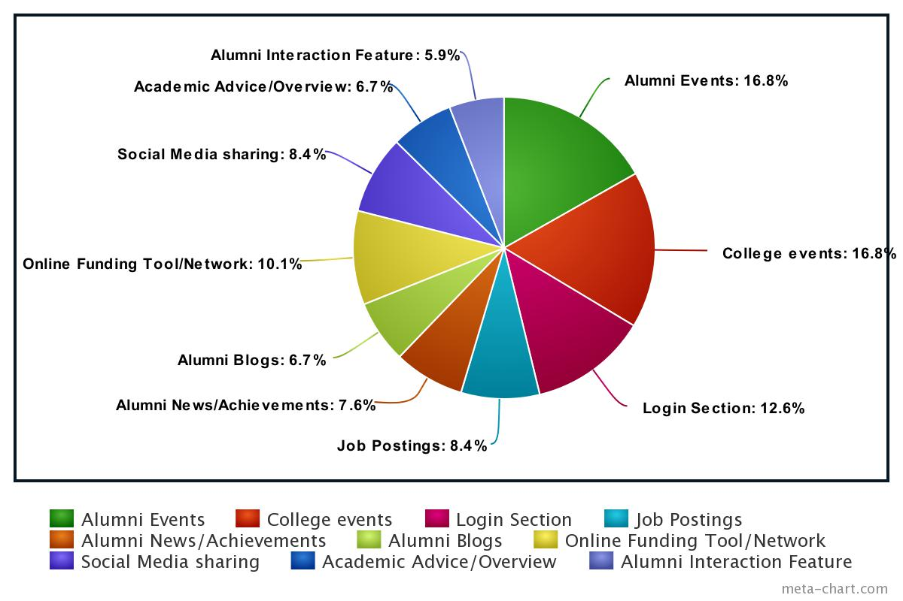

# 20CYS202-UIDesign
User Interface Design(20CYS202) SEM-03

## PROJECT-01: Alumni Portal!
*Each year in an university, hundreds of students pass out with good jobs/placements. And the ***Alumni Portal*** helps in maintaining
communication between the faculty and the graduates.*
*Alumni portal also presents a great a mean of communication between alumni and current students in the university to interact with each other.*

*In terms of, wastage of resources, the university is losing a lot both financially and opportunity wise, since some of well placed alumni cannot be tracked or contacted to help in donation or support in improvement of infrastructure within the university.*

*This project is focused on web-based application/ web-page, which as a new forms of interactive media between the ANU alumni members and non-alumni members (ANU community).*

***Through user analysis on the requirements for the portal, the following points are gathered.***
- ***Events:*** Information on alumni events and campus events.
- ***News:*** Updates on alumni and campus news, and emergency bulletins.
- ***Networking:*** alumni networking features, including ways to find out information about a classmate or other alum.
- ***Giving Back:*** A way to donate to the school and become engaged in a meaningful way.
- ***Job Interests:*** A section dedicated to finding job vacancies and oppurtunities.

***Users and Permissions:***
- ***Students/Alumni:*** Have control over their respective personal details and can connect with alumni.
- ***Faculties:*** Have their own accounts and are linked with their batch students and also can act as super user to students.
- ***Admin:*** Verifies and maintains the details of students and alumni. Add info regarding the events.

